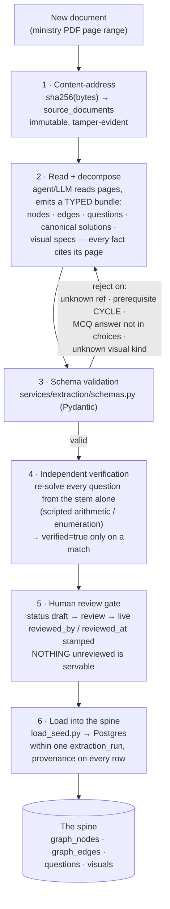
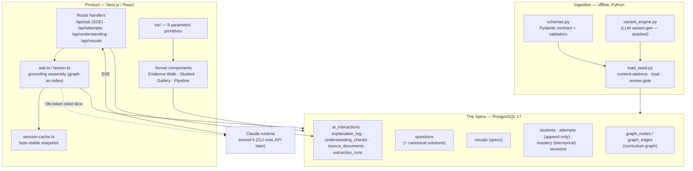

# AI.Next Tutor — System Design Deep Dive

*How the spine is built, how data is stored, why it differs from a conventional database, and what happens end-to-end when we ingest a document or answer a chat.*

- **Design authority:** the Agent-Native Data Spine thesis (ADR-0001)
- **Component choices:** ADR-0002 (AI runtime = Python; app = Next.js), ADR-0003 (store = Postgres + demo layer)
- **Audience:** technical co-founders / engineers doing diligence. Companion to `system-design.md` (the one-diagram version).
- **Date:** 2026-07-19

---

## 0. The one-sentence thesis

> A conventional app database stores *rows the app needs*. The spine stores *facts an AI agent can reason over* — structured, joinable, temporally explicit, and provenance-tracked — so that every answer the tutor gives is **grounded** (traceable to the official textbook), **interpretable** (you can see why), and **replayable** (you can reconstruct what it knew and when).

Everything below is an elaboration of that sentence.

---

## 1. What makes the spine different from a conventional database

We use a completely ordinary technology — PostgreSQL 17 — but we use it in four unconventional ways. The difference is **discipline in the schema**, not exotic infrastructure. That is a deliberate choice (ADR-0003): at pilot scale a dedicated graph/vector/temporal engine buys nothing that disciplined Postgres doesn't already give us, and it costs operational complexity a solo team can't afford.

| Dimension | Conventional app DB | The spine |
|---|---|---|
| **What a row means** | "the current value of a field" | "a fact, with where it came from and when it was true" |
| **Structure** | tables joined by foreign keys | a **knowledge graph** (nodes + typed edges) *modeled in* tables — the curriculum's prerequisite structure is first-class data |
| **History** | overwritten on update (`UPDATE` loses the past) | **bitemporal** — nothing is overwritten; every fact carries when it was true and when we knew it |
| **Provenance** | usually none | every fact carries a citation to the source document, page, and the extraction run that produced it |
| **Who reads it** | application code | application code **and an LLM agent**, which is handed a small, cited *slice* of the graph as its context |

The four pillars (from the thesis) and where they live in the schema:

1. **Deterministic, schema-first extraction** → `source_documents`, `extraction_runs`, and the Pydantic contract in `services/extraction/schemas.py`.
2. **The knowledge graph** → `graph_nodes` + `graph_edges` (a property graph in relational form).
3. **Bitemporal time** → `system_from`/`system_to` columns on `mastery` and `graph_edges`; `attempts` is append-only.
4. **Provenance** → `source_sha256`, `source_page`, `extraction_run_id` on every content row; `explanation_log` and `ai_interactions` for AI outputs.

---

## 2. Data storage model — the actual schema

The full DDL is `db/schema.sql` + `db/migrations/`. Grouped by role:

### 2.1 Provenance layer — "every fact has a receipt"

```
source_documents(sha256 PK, title, publisher, edition, language, grade, subject, file_path, ingested_at)
extraction_runs(id PK, source_sha256 FK, extractor, extractor_version, schema_version, started_at, finished_at)
```

- **`source_documents` is keyed by `sha256(file bytes)`.** The document's *content* is its identity. Re-ingesting the same PDF yields the same key; a changed byte yields a new key. This is "content-addressed storage" — the same idea Git uses for commits. It makes provenance tamper-evident: a citation to `sha256:38ee465d…` page 22 can be re-verified against the exact bytes forever.
- **`extraction_runs`** records *which pipeline version* produced a batch of facts (extractor, its version, the schema version). Every node/question/visual points back to its run, so if we later find a systematic extraction error we can identify and re-process exactly the affected facts.

### 2.2 The curriculum graph — a property graph in tables

```
graph_nodes(id PK, kind, label, description, syllabus_ref, order_in_parent,
            source_sha256, source_page, extraction_run_id, created_at)
graph_edges(id PK, src_id FK, dst_id FK, edge_type,
            syllabus_version, valid_from, valid_to, system_from, system_to,
            extraction_run_id)
```

- **Nodes** are typed (`kind ∈ program | course | module | learning_objective | topic`). A learning objective ("Inscribed angle = ½ subtended arc") is a node with a label, a description, and — critically — `source_page` so it cites the book.
- **Edges** are typed (`edge_type ∈ part_of | teaches | prerequisite_of | about`). The `prerequisite_of` edges form the **DAG** that is the heart of the product: "you must understand central angles before inscribed angles." 112 of these across the whole book, including cross-unit and cross-term links.
- **Why relational and not Neo4j?** The graph is <100 nodes deep and ~90 nodes wide. A prerequisite walk is a `WITH RECURSIVE` CTE that runs in microseconds. The thesis (Ch. 15.3) explicitly notes the simple cohort/versioning patterns "don't require special DB features." We modeled nodes/edges as first-class tables precisely so a future migration to a graph engine is a *projection*, not a redesign — the revisit triggers are written into ADR-0003 (multi-vertical reuse, GraphRAG, >1M edges).

Example — "what does Omar need before Quadratic functions?" is this query, not an application loop:

```sql
WITH RECURSIVE chain(id, depth) AS (
  SELECT src_id, 1 FROM graph_edges
    WHERE dst_id = 'lo:u1-4-3' AND edge_type='prerequisite_of' AND system_to IS NULL
  UNION ALL
  SELECT e.src_id, c.depth+1 FROM graph_edges e
    JOIN chain c ON e.dst_id = c.id
    WHERE e.edge_type='prerequisite_of' AND e.system_to IS NULL
)
SELECT DISTINCT id, depth FROM chain ORDER BY depth;
```

### 2.3 Question bank — content with lifecycle and provenance

```
questions(id PK, lo_id FK, tier, question_type, stem, choices JSONB,
          correct_answer, canonical_solution JSONB, solution_version,
          status, source, parent_question_id, source_sha256, source_page,
          source_note, extraction_run_id, reviewed_by, reviewed_at, created_at)
```

- **`canonical_solution`** is a JSONB array of human-reviewable steps. This is the anti-hallucination mechanism: at runtime the LLM is given these steps as *the only permitted mathematical path* — it explains via them, never solving from scratch.
- **`status ∈ draft | review | live | rejected | retired`** is a hard gate. The read path filters `WHERE status='live'` everywhere. Nothing unreviewed is servable — enforced in queries, not policy.
- **`parent_question_id`** lets an LLM-generated variant point back to the seed it was derived from (the variant engine, `services/extraction/variant_engine.py`, is stubbed for the PoC).

### 2.4 Student state — append-only + bitemporal

```
students(id PK, display_name, grade, created_at)
attempts(id PK, student_id FK, question_id FK, session_id, given_answer,
         is_correct, time_ms, attempted_at)          -- APPEND-ONLY
mastery(id PK, student_id FK, lo_id FK, score,
        system_from, system_to)                       -- BITEMPORAL
sessions(id PK, student_id FK, plan JSONB, assigned_at, completed_at)
```

- **`attempts` is never updated or deleted.** Every answer is an immutable event. This log is the defensibility asset the PRD names: at ~50k rows it can fit a proper Bayesian student model (BKT/IRT) — a v2 capability whose *training data* we are accruing from day one.
- **`mastery` is bitemporal.** The current mastery of an objective is the row with `system_to IS NULL`. When an answer moves it, we don't `UPDATE` — we **close the old row** (`SET system_to = now()`) and **insert a new open row**. The history is preserved. Consequence: "how much has Omar improved since his diagnostic?" — the PRD's success metric — is a native *as-of* query, not a report we have to compute and store:

```sql
-- mastery on lo:u1-4-3 as we believed it on the diagnostic date vs now
SELECT score FROM mastery
 WHERE student_id=1 AND lo_id='lo:u1-4-3'
   AND system_from <= :as_of AND (system_to > :as_of OR system_to IS NULL);
```

### 2.5 Visuals — figures as data, not image files

```
visuals(id PK, lo_id FK, question_id FK, kind, spec JSONB, caption,
        source_page, extraction_run_id, created_at)
```

- A visual is a `{kind, spec}` pair, not a PNG. `kind` is one of 9 parametric primitives (coordinate plot, function graph, geo scene, …); `spec` is the parameters. One renderer library in the app draws all 212 of them, animated, from data. This is why "hundreds of visuals" was cheap — we built 9 renderers, and the content is rows.

### 2.6 AI-output ledger — every model call is accounted for

```
explanation_log(... question_id, solution_version, model, prompt_version,
                 wrong_answer, output_md, grounded_ok, cached, created_at)
ai_interactions(... student_id, surface, turn_index, user_message,
                 assistant_message, grounding JSONB, citations JSONB, model,
                 input_tokens, output_tokens, cache_read_tokens,
                 cache_creation_tokens, cost_usd, latency_ms, created_at)
understanding_checks(... student_id, lo_id, mode, score, verdict,
                      strengths JSONB, gaps JSONB, next_step, turns)
```

- **`ai_interactions` logs every chat turn** with its cost, tokens (including prompt-cache hits/writes), the exact `grounding` slice it was given, and the `citations` it emitted. This is the AI-cost instrumentation the PRD demands "from day one" — and it makes the EGP 40/student/month ceiling observable per turn.
- `grounded_ok=false` on an explanation records the safety fallback firing (LLM output contradicted the canonical answer → we showed the canonical solution verbatim).

---

## 3. Technology & architecture choices (the "why")

| Layer | Choice | Alternatives rejected | Why (short) |
|---|---|---|---|
| **System of record** | PostgreSQL 17, graph modeled relationally | Neo4j / KuzuDB (graph), a lakehouse | One store, one backup story (minors' data), both runtimes speak SQL. KuzuDB (thesis-endorsed) was **abandoned by its sponsor Oct 2025** — dodged. <5k nodes → recursive CTEs are instant. ADR-0003. |
| **Extraction / AI service** | Python + Pydantic | TypeScript/Zod | Pydantic *is* the thesis's typed-schema-with-validation pattern; best ecosystem for extraction + eval + symbolic verification (agents used `fractions`/enumeration to self-check answers). ADR-0002. |
| **Application** | Next.js / React (App Router) | plain SPA, SvelteKit | Largest ecosystem for RTL + KaTeX math + PWA/offline; server components let pages query Postgres directly. ADR-0002. |
| **LLM runtime (PoC)** | local `claude` CLI, claude-sonnet-5, streamed | direct Anthropic API | Zero setup on the founder's machine, real streaming, no key management for a laptop demo. **Deliberately a PoC-only choice** — the CLI→API swap is a recorded pre-deployment ADR (needed for hosting, thinking-budget control, and true `cache_control` placement). |
| **Graph store demo** | in-app SVG "Evidence Walk" | Neo4j Bloom | Runs anywhere offline; an AuraDB-Free Bloom projection stays an optional extra (ADR-0003 rider). |
| **Visuals** | 9 parametric SVG primitives, data-driven | rendered images / videos | Content becomes rows, not asset files; animated ("draws itself"); ~5% of the effort of hand-made assets. |

Cross-cutting principles that shaped the schema: **provenance end-to-end**, **schema-first (validate before store)**, **the graph is the index** (§5), **time is first-class**, **grounded generation** (canonical solutions, logged fallback).

---

## 4. Pipeline A — what happens when we ingest a new document

This is the "batch" path. It runs offline, produces reviewed facts, and never touches the student runtime. Today it is human-in-the-loop agent-assisted (a Claude agent reads the PDF and authors a typed bundle); the automated `variant_engine` follows the same contract.



**Step by step, technically:**

1. **Content-address.** `load_seed.py` computes `sha256` of the source file and writes/looks up `source_documents`. The document's bytes are its permanent identity.
2. **Decompose into a typed bundle.** The producer (a Claude extraction agent today; the `variant_engine` for generated variants tomorrow) emits a JSON bundle conforming to `SeedBundle` — learning-objective nodes, prerequisite edges, questions with step-by-step canonical solutions, and visual specs. **Schema-first, not text-first:** the model must fill a *shape*, and each fact carries `source_page`.
3. **Validate before anything is stored** (`schemas.py`, Pydantic). The validators are strict and catch real errors: referential integrity (no edge to an undefined node), **DAG acyclicity** (a depth-first check rejects a prerequisite cycle — you cannot say A needs B needs A), MCQ answer-key sanity (the correct key must exist among the choices), and known visual `kind`. Invalid bundles are rejected, not stored.
4. **Independent verification.** Each extraction agent re-solves every question *from the stem alone* and only sets `verified=true` on a match. Several agents wrote throwaway `fractions`/sample-space-enumeration scripts to do this mechanically. Across the book: 421/450 confirmed, 0 unresolved discrepancies.
5. **Human review gate.** Questions enter at `status='review'`. A human (founder, or the PRD's part-time math teacher) promotes to `live`, stamping `reviewed_by`/`reviewed_at`. *This is the trust moat and the one step still owed for the 450 questions.* (For PoC demos the loader has an `--approve-all` shortcut that marks the reviewer as `poc bulk` — explicitly not a real review.)
6. **Load.** `load_seed.py` writes nodes, edges, questions, and visuals inside one `extraction_run`, so every row is provenance-linked. The loader handles multi-bundle loads with cross-bundle references (e.g. the geometry unit references `course:prep3-math-en` defined in unit 1) and enforces load order for cross-references.

**Technology behind Pipeline A:** Python 3.12, Pydantic 2 (typed schemas + validation), psycopg 3 (Postgres driver), `uv` (env/runner). No ML infrastructure, no orchestrator, no lakehouse — deliberately (thesis Ch. 19.6 MVP cut). Adding a unit = one bundle file through the same path (~1 day/unit observed).

**Bitemporal on ingestion:** `graph_edges` carry `syllabus_version` + `valid_from/valid_to`. When the ministry revises the 2026/27 book, the new syllabus loads as a new version; old and new coexist, and queries filter by version — the PRD's top risk ("syllabus may shift year to year") becomes a data operation, not a rebuild.

---

## 5. Pipeline B — what happens during a normal chat turn

This is the "online" path: low-latency, per student, per session. **The single most important idea: the AI never reads the textbook at runtime. The graph is the index.** The student's state selects a small, cited slice of the spine (~8k tokens) regardless of whether the curriculum is 178 or 10,000 pages.

```mermaid
sequenceDiagram
    participant U as Student (browser)
    participant R as Next.js route<br/>/api/ask (SSE)
    participant DB as Postgres (spine)
    participant SC as Session cache
    participant L as Claude runtime<br/>(CLI, sonnet-5)

    U->>R: POST message + chatSession + (surface, lesson, questionId)
    R->>DB: turn count for this session → enforce per-surface cap
    R->>SC: snapshot(key)? 
    alt first turn of session
        SC->>DB: buildAskContext / buildLessonContext
        DB-->>SC: LOs+mastery, prereq edges, FOCUS bank<br/>(8 weakest LOs: stems + canonical solution + figures),<br/>compact index for the rest
        Note over SC: byte-stable grounding<br/>snapshot (cache-hot prefix)
    else later turns
        SC-->>R: replay identical grounding
    end
    R->>L: spawn claude -p --system-prompt "<rules + data block>"<br/>--stream-json ; user prompt = transcript only
    L-->>R: token deltas (SSE)
    R-->>U: stream deltas → paced "beat" reveal,<br/>citation chips, {{show_question}}/{{widget:viz_ref}} directives
    L->>R: final: text + usage (tokens, cache, cost, latency)
    R->>DB: INSERT ai_interactions (grounding, citations, cost, cache cols)
```

**Step by step, technically** (`app/src/app/api/ask/route.ts` + `app/src/lib/ask.ts`):

1. **Request.** The browser POSTs the message, a `chatSession` id, the `surface` (`spine_chat` | `student_chat` | `lesson_learn` | `lesson_review`), and optionally a `lesson` slug or a `questionId` in scope.
2. **Cap check.** A `SELECT count(*)` over `ai_interactions` for this session enforces the per-surface turn cap (e.g. review mode ≤ 5) server-side — the client can't bypass it.
3. **Grounding assembly — the graph-as-index step** (`buildAskContext`). One `Promise.all` of Postgres queries pulls: all learning objectives with baseline+current mastery, the prerequisite edge list, all live questions, the module list, and the visuals. Then it computes a **focus set** = the in-scope question's LO + the 8 weakest LOs (`FOCUS_LO_COUNT`). The data block is built asymmetrically:
   - **Focus LOs get the full treatment:** descriptions, question *stems*, the **human-reviewed canonical solution** for the in-scope question, and the figure catalog.
   - **Everything else is a compact index:** LO label + mastery + question *counts* + figure ids — enough for the model to reason about coverage and cite, without shipping all 450 stems.
   
   This is what keeps a turn at ~8k input tokens instead of ~40k. It is literally the thesis's "graph selects the pages" principle in code.
4. **Session snapshot for cache stability** (`session-cache.ts`). The grounding block must be **byte-identical across the turns of one session**, because it rides in the *system prompt* — the cacheable prefix. The context is built once on turn 1 and replayed verbatim; mastery is snapshotted, not re-interpolated (a live mastery number changing mid-chat would bust the prompt cache every turn). Result: turn 2+ read the ~8k prefix from cache; steady-state spine turn ≈ $0.014.
5. **Prompt construction.** The **system prompt** = grounding rules + the data block (stable → cache-hot). The **user prompt** = only the growing transcript. The hard rules in the system prompt: *the data is your only source of truth; never solve from scratch — explain only via the provided canonical solution; cite everything with `[[lo:…]]`/`[[q:…]]`/`[[page:…]]`; emit interactive directives (`{{show_question}}`, `{{widget:viz_ref:…}}`, `{{highlight}}`) on their own lines; write in `{{beat}}`-separated micro-beats.*
6. **Generation.** The route `spawn`s the `claude` CLI with `--output-format stream-json --disallowedTools "*" --max-turns 1` and streams token deltas back over SSE. (Tools disabled + single turn = it's a pure grounded-generation call, ~50× cheaper than a full agent.)
7. **Client rendering.** The browser parses the stream (`chat-parse.ts`, a defensive brace-scanner) and reveals it beat-by-beat at reading pace; citation markers become clickable receipt-chips that light up graph nodes; `{{show_question}}`/`{{widget:viz_ref}}` render live interactive cards on the whiteboard.
8. **Ledger write.** On completion the route inserts one `ai_interactions` row: the assistant text, the exact `grounding` slice, the `citations` emitted, model, input/output tokens, **cache-read/cache-creation tokens**, `cost_usd`, and `latency_ms`.

**If the student answers a question mid-chat** (`/api/attempts`), a separate transaction runs the write side of the spine: append the immutable `attempts` row, then the **bitemporal mastery update** — `SELECT … FOR UPDATE` the open mastery row, close it (`system_to = now()`), insert a new open row with an Elo-style score `clamp(old + 0.15·(outcome − old), 0.02, 0.98)`, and (on a wrong answer) log to `explanation_log`. All in one `BEGIN…COMMIT`. The graph's colors then reflect the new state; the history remains queryable.

**Technology behind Pipeline B:** Next.js route handlers (Node), `pg` connection pool, Server-Sent Events for streaming, the `claude` CLI as the model runtime, an in-process session-cache map (Redis/Postgres in a deployed version). No vector database, no RAG framework — retrieval is *structural* (walk the graph from the student's state), not semantic similarity.

---

## 6. Software architecture at a glance



**Two runtimes, one store.** Python owns ingestion (write-heavy, offline, typed). Next.js owns the product (read-heavy, online, streaming). Both speak SQL to the same Postgres — the single system of record that made ADR-0003's "one store, one backup story" the right call for a solo team handling minors' data.

---

## 7. Frequently-asked "so what's really novel?"

- **It's not the database technology** — it's Postgres. It's the *schema discipline*: facts not fields, graph not just tables, history not overwrites, citations on everything.
- **It's not RAG** — there's no vector search. Retrieval is a structural walk of the prerequisite graph from the student's mastery state. That's more precise (no "semantically similar but wrong" chunks) and fully explainable.
- **The moat is the reviewed, provenance-tracked, curriculum-aligned fact base** plus the attempt-level dataset accruing under it — not the LLM (which is a commodity we call). The same spine architecture ports to any curriculum or, per the thesis, any document-heavy vertical.

---

## 8. Honest limitations (PoC status, 2026-07-19)

- **Human review is the owed step.** 450 questions are machine-verified twice but human-reviewed zero times; `--approve-all` was used for demos.
- **LLM runtime is the local CLI** — single machine, no deployment. The API swap is a recorded pre-deployment ADR.
- **Session cache is in-process** — fine for one dev server; a deployment needs Redis/Postgres-backed.
- **Student model is Elo-style arithmetic**, deliberately (PRD non-goal). The `attempts` log is designed to fit BKT/IRT at ~50k rows (v2).
- **No auth/PWA/offline yet** on the student surface — the current `/student` is the desktop demo, not the production mobile-web app.

See `docs/PROJECT_STATE.md` for live status and `docs/decisions/` for the ADRs behind every choice above.
