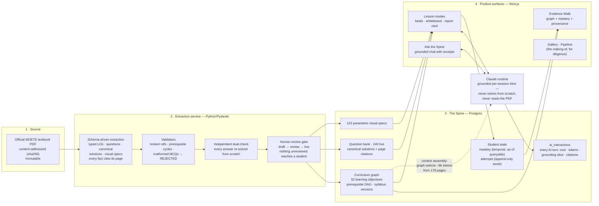

# AI.Next Tutor PoC — System Design

- **Design authority:** the Agent-Native Data Spine thesis (ADR-0001); components per ADR-0002/0003
- **Date:** 2026-07-18

## The system in one diagram



## The five design principles it encodes

1. **Provenance end-to-end** — source bytes are content-addressed; every learning objective, question, and visual carries a citation to its book page; every AI answer carries receipts. (Thesis Pillar IV)
2. **Schema-first extraction** — the model fills typed contracts, validated before anything enters the spine; structure (prerequisite DAG) is explicit data, not prose. (Pillar I)
3. **The graph is the index** — the AI never reads the book at runtime; the student's mastery state selects a small graph neighborhood (~8k tokens) as context, so the same architecture serves 178 or 10,000 pages. (Pillars II)
4. **Time is first-class** — mastery history is never overwritten; "score lift since the diagnostic" is a native as-of query. (Pillar III)
5. **Grounded generation** — explanations derive from human-approved canonical solutions; a contradiction triggers fallback to the canonical text verbatim. Cost/latency of every AI turn is logged from day one.

## Component choices (decided in ADRs 0001–0003)
| Layer | Choice | Why |
|---|---|---|
| System of record | Postgres 17 (graph modeled relationally) | One store, one backup story, both runtimes speak SQL; <5k-node graph needs no graph engine yet — revisit triggers recorded |
| Extraction/AI service | Python + Pydantic | Thesis-native typed-schema pattern |
| App | Next.js/React | RTL/math/PWA ecosystem, fast iteration |
| LLM runtime (PoC) | claude CLI (local auth), claude-sonnet-5 | Zero-setup for demos; CLI→API swap is a recorded pre-deployment ADR |
```
